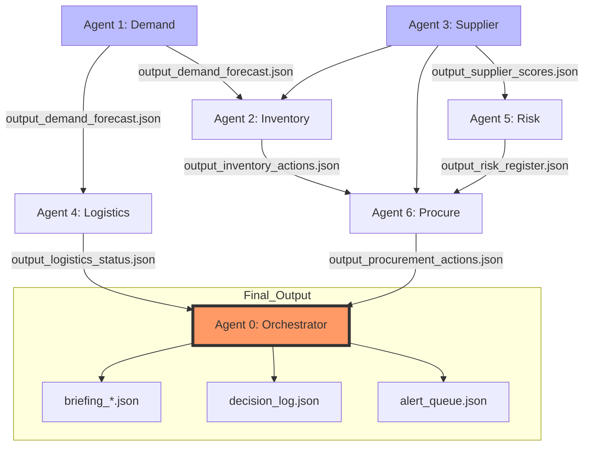

# AGENT WIRING MAP — CROSS-AGENT DEPENDENCY AUDIT

## Overview
This document serves as the master technical reference for data handoffs within the agentic ecosystem. It maps every interaction between autonomous agents to ensure data integrity, execution sequencing, and error handling.

**Each mapping includes:**
* **Source Agent:** The origin of the data, the specific output file, and the exact field path.
* **Destination Agent:** The specific step, function, and variable where the data is ingested.
* **Failure Protocol:** Defined behavior and system state if a dependency is missing or corrupted.

---

## System Architecture & Execution Order
The following diagram illustrates the enforced execution flow and data dependencies.



### ASCII Flow Map (Original)
```text
 ┌──────────────────┐ 
 │  Agent 1: Demand  │──────────────────────────────────────────────┐ 
 │  (no upstream)    │                                              │ 
 └────────┬─────────┘                                               │ 
          │                                                         │ 
          │ output_demand_forecast.json                             │ 
          │                                                         │ 
          ▼                                                         │ 
 ┌──────────────────┐     ┌──────────────────┐                      │ 
 │ Agent 2: Inventory│◄────│ Agent 3: Supplier │                      │ 
 │ (needs Agent 1)   │     │ (no agent upstream│                      │ 
 └────────┬─────────┘     │  uses raw files)  │                      │ 
          │                └────────┬─────────┘                      │ 
          │                         │                                │ 
          │ output_inventory_       │ output_supplier_               │ 
          │ actions.json            │ scores.json                    │ 
          │                         │                                │ 
          │    ┌────────────────────┘                                │ 
          │    │                                                     │ 
          ▼    ▼                                                     │ 
 ┌──────────────────┐     ┌──────────────────┐                      │ 
 │ Agent 5: Risk     │     │ Agent 4: Logistics│◄────────────────────┘ 
 │ (needs Agent 3)   │     │ (needs Agent 1)   │ 
 └────────┬─────────┘     └────────┬─────────┘ 
          │                         │ 
          │ output_risk_            │ output_logistics_ 
          │ register.json           │ status.json 
          │                         │ 
          ▼                         │ 
 ┌──────────────────┐               │ 
 │ Agent 6: Procure  │◄─────────────┘ (indirect, via Orchestrator) 
 │ (needs 2, 3, 5)   │ 
 └────────┬─────────┘ 
          │ 
          │ output_procurement_actions.json 
          │ 
          ▼ 
 ┌──────────────────┐ 
 │ Agent 0: Orchestr │◄── reads ALL 6 agent outputs 
 │ (needs ALL)       │ 
 └──────────────────┘ 
          │ 
          ▼ 
 briefing_*.json, decision_log.json, alert_queue.json 
```

---

## Dependency Registry

| Agent | Name | Upstream Dependencies | Primary Output File |
| :--- | :--- | :--- | :--- |
| **Agent 1** | Demand | None (Raw Data) | `output_demand_forecast.json` |
| **Agent 2** | Inventory | Agent 1 | `output_inventory_actions.json` |
| **Agent 3** | Supplier | None (Raw Data) | `output_supplier_scores.json` |
| **Agent 4** | Logistics | Agent 1 | `output_logistics_status.json` |
| **Agent 5** | Risk | Agent 3 | `output_risk_register.json` |
| **Agent 6** | Procure | Agents 2, 3, 5 | `output_procurement_actions.json` |
| **Agent 0** | Orchestrator | **ALL** (Agents 1-6) | `briefing_*.json`, `decision_log.json`, `alert_queue.json` |

---

## Detailed Data Handoffs (Wires)

### ━━━━━━━━━━━━━━━━━━━━━━━━━━━━━━━━━━━━━━━━━━━━━━━━━━━━━━━━━━━━
### WIRE 1: Agent 1 (Demand) → Agent 2 (Inventory)
### ━━━━━━━━━━━━━━━━━━━━━━━━━━━━━━━━━━━━━━━━━━━━━━━━━━━━━━━━━━━━

* **Source Agent:** Agent 1 (Demand)
    * **Output File:** `output_demand_forecast.json`
    * **Exact Field Path:** `$.forecast_results.sku_level_demand`
* **Destination Agent:** Agent 2 (Inventory)
    * **Execution Step:** Step 2: Safety Stock Calculation
    * **Target Function:** `calculate_reorder_points()`
    * **Input Variable:** `projected_demand_volume`
* **Dependency Failure Protocol:**
    * **Impact:** Critical. Agent 2 cannot determine stock-out risks.
    * **Action:** Fallback to historical 30-day average demand; flag "High Uncertainty" in `alert_queue.json`.

---

## Final Output Artifacts
The Orchestrator (Agent 0) synthesizes all upstream data into the following:
1.  **`briefing_*.json`**: Executive summary of system state.
2.  **`decision_log.json`**: Audit trail of every automated action taken by the agents.
3.  **`alert_queue.json`**: Priority-ranked list of issues requiring human intervention.
 
## What is passed: 
- **File:** `output_demand_forecast.json` 
- **Exact fields consumed:** 
 
| Source Path (Agent 1 Output) | Dest Agent | Dest Step | Dest Function | Dest Variable | Purpose | 
|---|---|---|---|---|---| 
| `forecasts[].sku_id` | Agent 2 | Step 1 | `load_inventory_context()` | `forecast_map` key | Match forecast to SKU | 
| `forecasts[].computation.forecast_weekly` | Agent 2 | Step 2 | `analyze_sku()` | `weekly_demand` | Calculate DOI, reorder qty | 
| `forecasts[].computation.confidence` | Agent 2 | Step 2 | `analyze_sku()` | `forecast_confidence` | Set per-SKU confidence level | 
| `forecasts[].computation.demand_class` | Agent 2 | Step 2 | `analyze_sku()` | (used in LLM step) | Differentiate safety stock strategy | 
| `forecasts[].computation.trend` | Agent 2 | Step 4 | LLM Interpretation | Narrative context | Explain WHY demand is high/low | 
| `forecasts[].computation.forecast_4wk_total` | Agent 2 | Step 2 | `analyze_sku()` | `target_stock = (weekly_demand * 4) + safety_stock` | Recommended order quantity | 
 
## Exact injection point in Agent 2 code: 
 
```python 
# In Agent 2 → Step 1 → load_inventory_context(): 
# Line where Agent 1 output is loaded: 
with open(forecast_path) as f:          # ← forecast_path = "output_demand_forecast.json" 
    forecasts = json.load(f) 
 
# Build lookup map from Agent 1 output: 
forecast_map = {} 
for fc in forecasts.get("forecasts", []): 
    forecast_map[fc["sku_id"]] = fc["computation"]  # ← keyed by sku_id 
 
# In Agent 2 → Step 2 → analyze_sku(): 
# Line where Agent 1 data is consumed: 
forecast = forecast_map.get(sku_id)     # ← lookup by current SKU 
if forecast and forecast.get("forecast_weekly"): 
    avg_daily_demand = forecast["forecast_weekly"] / 7   # ← THIS is the critical number 
    weekly_demand = forecast["forecast_weekly"] 
    forecast_confidence = forecast["confidence"] 
else: 
    # FALLBACK if Agent 1 output missing for this SKU 
    avg_daily_demand = reorder_point / (lead_time * 2) 
    weekly_demand = avg_daily_demand * 7 
    forecast_confidence = "No Forecast — Using Estimate" 
``` 
 
## If Agent 1 output is MISSING entirely: 
- Agent 2 → Step 1 → `load_inventory_context()` will fail to open file 
- **Fallback:** Agent 2 MUST catch FileNotFoundError and use the fallback 
  formula: `avg_daily_demand = reorder_point / (lead_time * 2)` 
- **Flag in output:** `"forecast_source": "Fallback — Agent 1 output unavailable"` 
 
 
# ━━━━━━━━━━━━━━━━━━━━━━━━━━━━━━━━━━━━━━━━━━━━━━━━━━━━━━━━━━━━━━━━━━━━━━━━━━ 
# WIRE 2: Agent 1 (Demand) → Agent 4 (Logistics) 
# ━━━━━━━━━━━━━━━━━━━━━━━━━━━━━━━━━━━━━━━━━━━━━━━━━━━━━━━━━━━━━━━━━━━━━━━━━━ 
 
## What is passed: 
- **File:** `output_demand_forecast.json` 
- **Exact fields consumed:** 
 
| Source Path (Agent 1 Output) | Dest Agent | Dest Step | Dest Function | Dest Variable | Purpose | 
|---|---|---|---|---|---| 
| `forecasts[].sku_id` | Agent 4 | Step 2 | `assess_stockout_impact()` | `forecast` lookup key | Match forecast to delayed shipment's SKU | 
| `forecasts[].computation.forecast_weekly` | Agent 4 | Step 2 | `assess_stockout_impact()` | `weekly_demand` | Calculate days_of_stock and gap_days | 
 
## Exact injection point in Agent 4 code: 
 
```python 
# In Agent 4 → Step 2 → assess_stockout_impact(): 
# Parameters received: 
def assess_stockout_impact(shipment, inventory_item, forecast): 
    # ↑ forecast = forecasts[].computation from Agent 1, passed by caller 
 
    weekly_demand = forecast.get("forecast_weekly", 0) if forecast else 0 
    # ↑ THIS is Agent 1's number being used 
 
    daily_demand = weekly_demand / 7 if weekly_demand > 0 else 0 
    days_of_stock = current_stock / daily_demand  # ← drives stockout prediction 
``` 
 
## How the caller passes it: 
 
```python 
# In Agent 4's main loop (NOT shown in original prompt — MUST BE ADDED): 
# This is the missing glue code: 
 
# Load Agent 1 output 
with open("output_demand_forecast.json") as f: 
    demand_data = json.load(f) 
forecast_map = {fc["sku_id"]: fc["computation"] for fc in demand_data.get("forecasts", [])} 
 
# For each delayed shipment: 
for shipment in delayed_shipments: 
    sku_id = shipment["sku_id"] 
    inv_item = inventory_lookup[sku_id] 
    forecast = forecast_map.get(sku_id)   # ← Agent 1 data injected here 
    impact = assess_stockout_impact(shipment, inv_item, forecast) 
``` 
 
## If Agent 1 output is MISSING: 
- `forecast` parameter will be `None` 
- Function handles it: `weekly_demand = forecast.get("forecast_weekly", 0) if forecast else 0` 
- **Result:** `daily_demand = 0` → `days_of_stock = inf` → `will_cause_stockout = False` 
- **Problem:** This is WRONG — it hides real stockout risk 
- **Better fallback:** Use `inventory_item["reorder_point"] / (inventory_item["lead_time_days"] * 2) * 7` 
- **Flag:** `"forecast_source": "Fallback — demand data unavailable, impact may be underestimated"` 
 
 
# ━━━━━━━━━━━━━━━━━━━━━━━━━━━━━━━━━━━━━━━━━━━━━━━━━━━━━━━━━━━━━━━━━━━━━━━━━━ 
# WIRE 3: Agent 3 (Supplier) → Agent 5 (Risk) 
# ━━━━━━━━━━━━━━━━━━━━━━━━━━━━━━━━━━━━━━━━━━━━━━━━━━━━━━━━━━━━━━━━━━━━━━━━━━ 
 
## What is passed: 
- **File:** `output_supplier_scores.json` 
- **Exact fields consumed:** 
 
| Source Path (Agent 3 Output) | Dest Agent | Dest Step | Dest Function | Dest Variable | Purpose | 
|---|---|---|---|---|---| 
| `supplier_scorecards[].supplier_id` | Agent 5 | Step 1 | `scan_internal_risks()` | Loop iterator | Iterate over each supplier | 
| `supplier_scorecards[].score.composite_score` | Agent 5 | Step 1 | `scan_internal_risks()` | Risk description text | Include score in risk detail | 
| `supplier_scorecards[].risk.overall_risk` | Agent 5 | Step 1 | `scan_internal_risks()` | `if sc["risk"]["overall_risk"] in ["Critical", "High"]` | TRIGGER condition for creating a risk entry | 
| `supplier_scorecards[].risk.risk_flags[]` | Agent 5 | Step 1 | `scan_internal_risks()` | `[f['flag'] for f in sc['risk']['risk_flags']]` | Populate risk description | 
| `supplier_scorecards[].risk.single_source_skus` | Agent 5 | Step 1 | `scan_internal_risks()` | `affected_skus` | Map risk to specific SKUs | 
| `supplier_scorecards[].risk.contract_days_remaining` | Agent 5 | Step 1 | `scan_internal_risks()` | `if days <= 30` | Contract expiry risk detection | 
| `summary.critical_single_source` | Agent 5 | Step 1 | `scan_internal_risks()` | Single-source risk loop | Generate single-source dependency risks | 
| `summary.high_risk_suppliers` | Agent 5 | Step 1 | `scan_internal_risks()` | (used in summary) | Count high-risk suppliers | 
 
## Exact injection point in Agent 5 code: 
 
```python 
# In Agent 5 → Step 1 → scan_internal_risks(): 
def scan_internal_risks(supplier_scores, inventory, shipments): 
    risks = [] 
 
    # ↓↓↓ THIS is where Agent 3 output is consumed ↓↓↓ 
    for sc in supplier_scores["supplier_scorecards"]:          # ← Agent 3 data 
        if sc["risk"]["overall_risk"] in ["Critical", "High"]: # ← Agent 3 field 
            affected_skus = sc["risk"].get("single_source_skus", [])  # ← Agent 3 field 
            risks.append({ 
                "description": f"Composite score: {sc['score']['composite_score']}/100. "  # ← Agent 3 
                              f"Risk flags: {[f['flag'] for f in sc['risk']['risk_flags']]}",  # ← Agent 3 
                # ... 
            }) 
 
    # ↓↓↓ Single-source dependency section also uses Agent 3 ↓↓↓ 
    single_source = supplier_scores["summary"]["critical_single_source"]  # ← Agent 3 
    for sup_id, skus in single_source.items(): 
        risks.append({...}) 
``` 
 
## If Agent 3 output is MISSING: 
- Agent 5 Step 1 cannot run internal risk scan 
- **Fallback:** Skip internal supplier risks entirely. Run only external risk scan (LLM step). 
- **Flag:** `"internal_risk_scan": "Skipped — Agent 3 output unavailable"` 
- **Impact:** Misses supplier performance degradation risks. External risks still work. 
 
 
# ━━━━━━━━━━━━━━━━━━━━━━━━━━━━━━━━━━━━━━━━━━━━━━━━━━━━━━━━━━━━━━━━━━━━━━━━━━ 
# WIRE 4: Agent 2 (Inventory) → Agent 6 (Procurement) 
# ━━━━━━━━━━━━━━━━━━━━━━━━━━━━━━━━━━━━━━━━━━━━━━━━━━━━━━━━━━━━━━━━━━━━━━━━━━ 
 
## What is passed: 
- **File:** `output_inventory_actions.json` 
- **Exact fields consumed:** 
 
| Source Path (Agent 2 Output) | Dest Agent | Dest Step | Dest Function | Dest Variable | Purpose | 
|---|---|---|---|---|---| 
| `sku_analysis[].sku_id` | Agent 6 | Step 1 | `get_reorder_needs()` | `item["sku_id"]` | Identify which SKUs need ordering | 
| `sku_analysis[].reorder.needed` | Agent 6 | Step 1 | `get_reorder_needs()` | `if item["reorder"]["needed"]` | TRIGGER — only process items where this = true | 
| `sku_analysis[].reorder.recommended_qty` | Agent 6 | Step 1 | `get_reorder_needs()` | `"recommended_qty"` | How much to order | 
| `sku_analysis[].urgency` | Agent 6 | Step 1 | `get_reorder_needs()` | `"urgency"` | Priority sorting of PO drafts | 
| `sku_analysis[].metrics.current_stock` | Agent 6 | Step 1 | `get_reorder_needs()` | `"current_stock"` | PO justification text | 
| `sku_analysis[].metrics.will_stockout_before_reorder` | Agent 6 | Step 1 | `get_reorder_needs()` | Duplicate PO check override | If true, create PO even if open PO exists | 
| `sku_analysis[].metrics.revenue_at_risk_inr` | Agent 6 | Step 1 | `get_reorder_needs()` | `"revenue_at_risk_inr"` | PO justification and priority | 
| `sku_analysis[].primary_supplier` | Agent 6 | Step 2 | `select_supplier()` | `need["primary_supplier"]` | Starting point for supplier selection | 
| `sku_analysis[].secondary_supplier` | Agent 6 | Step 2 | `select_supplier()` | `need["secondary_supplier"]` | Fallback supplier option | 
| `sku_analysis[].unit_cost` | Agent 6 | Step 3 | `generate_po_draft()` | `need["unit_cost"]` | Calculate PO total cost | 
 
## Exact injection point in Agent 6 code: 
 
```python 
# In Agent 6 → Step 1 → get_reorder_needs(): 
def get_reorder_needs(inventory_output, existing_pos): 
    # ↓↓↓ Agent 2 output is the PRIMARY input ↓↓↓ 
    for item in inventory_output["sku_analysis"]:          # ← Agent 2 output 
        if item["reorder"]["needed"]:                       # ← Agent 2 trigger field 
            sku_id = item["sku_id"] 
 
            # Duplicate PO check 
            has_open_po = sku_id in open_po_skus 
            if has_open_po and not item["will_stockout_before_reorder"]:  # ← Agent 2 
                continue  # Skip — existing PO is sufficient 
 
            needs.append({ 
                "recommended_qty": item["reorder"]["recommended_qty"],  # ← Agent 2 
                "urgency": item["urgency"],                              # ← Agent 2 
                "primary_supplier": item["primary_supplier"],            # ← Agent 2 
                "secondary_supplier": item.get("secondary_supplier"),    # ← Agent 2 
                "revenue_at_risk_inr": item["revenue_at_risk_inr"],     # ← Agent 2 
                # ... 
            }) 
``` 
 
## If Agent 2 output is MISSING: 
- Agent 6 has NOTHING to work with — it cannot determine what to order 
- **Fallback:** Agent 6 cannot run. Output: `{"status": "skipped", "reason": "Agent 2 output unavailable — no reorder recommendations to process"}` 
- **This is a HARD dependency.** Agent 6 cannot function without Agent 2. 
 
 
# ━━━━━━━━━━━━━━━━━━━━━━━━━━━━━━━━━━━━━━━━━━━━━━━━━━━━━━━━━━━━━━━━━━━━━━━━━━ 
# WIRE 5: Agent 3 (Supplier) → Agent 6 (Procurement) 
# ━━━━━━━━━━━━━━━━━━━━━━━━━━━━━━━━━━━━━━━━━━━━━━━━━━━━━━━━━━━━━━━━━━━━━━━━━━ 
 
## What is passed: 
- **File:** `output_supplier_scores.json` 
- **Exact fields consumed:** 
 
| Source Path (Agent 3 Output) | Dest Step in Agent 6 | Dest Function | Variable | Purpose | 
|---|---|---|---|---| 
| `supplier_scorecards[].supplier_id` | Step 2 | `select_supplier()` | `score_map` key | Build supplier score lookup | 
| `supplier_scorecards[].score.composite_score` | Step 2 | `select_supplier()` | `primary_score`, `secondary_score` | Compare primary vs secondary supplier | 
| `supplier_scorecards[].risk.overall_risk` | Step 2 | `select_supplier()` | `primary_risk` | Decision: if "Critical"/"High" → switch to secondary | 
| `supplier_scorecards[].supplier_name` | Step 3 | `generate_po_draft()` | PO detail | Include in PO document | 
 
## Exact injection point in Agent 6 code: 
 
```python 
# In Agent 6 → Step 2 → select_supplier(): 
def select_supplier(need, supplier_scores, risk_register, supplier_master): 
    # ↓↓↓ Agent 3 output builds the score lookup ↓↓↓ 
    score_map = {sc["supplier_id"]: sc 
                 for sc in supplier_scores["supplier_scorecards"]}  # ← Agent 3 output 
 
    primary_score = score_map.get(primary, {}).get("score", {}).get("composite_score", 0) 
    #                                                ↑ Agent 3 field 
 
    primary_risk = score_map.get(primary, {}).get("risk", {}).get("overall_risk", "Low") 
    #                                              ↑ Agent 3 field 
 
    primary_at_risk = primary_risk in ["Critical", "High"]  # ← Decision gate using Agent 3 
 
    # If primary is risky, try secondary: 
    if primary_at_risk and secondary and secondary_score >= 60: 
        selected = secondary  # ← Agent 3 data drives this decision 
``` 
 
## If Agent 3 output is MISSING: 
- `score_map` will be empty → all scores default to 0 → all suppliers appear equal 
- **Fallback:** Use `primary_supplier` from Agent 2 output (which came from `inventory_master.json`). Skip risk-based switching. 
- **Flag:** `"supplier_selection_basis": "Default — Agent 3 scores unavailable, using primary supplier from inventory"` 
 
 
# ━━━━━━━━━━━━━━━━━━━━━━━━━━━━━━━━━━━━━━━━━━━━━━━━━━━━━━━━━━━━━━━━━━━━━━━━━━ 
# WIRE 6: Agent 5 (Risk) → Agent 6 (Procurement) 
# ━━━━━━━━━━━━━━━━━━━━━━━━━━━━━━━━━━━━━━━━━━━━━━━━━━━━━━━━━━━━━━━━━━━━━━━━━━ 
 
## What is passed: 
- **File:** `output_risk_register.json` 
- **Exact fields consumed:** 
 
| Source Path (Agent 5 Output) | Dest Step in Agent 6 | Dest Function | Variable | Purpose | 
|---|---|---|---|---| 
| `risks[].affected_suppliers[]` | Step 2 | `select_supplier()` | `risk_register["risks"]` loop | Check if selected supplier has active risk | 
| `risks[].title` | Step 2 | `select_supplier()` | `risk_warning` | Include risk warning text in PO draft | 
 
## Exact injection point in Agent 6 code: 
 
```python 
# In Agent 6 → Step 2 → select_supplier(): 
def select_supplier(need, supplier_scores, risk_register, supplier_master): 
    # ... 
    # ↓↓↓ Agent 5 output checked for supplier warnings ↓↓↓ 
    risk_warning = None 
    for risk in risk_register.get("risks", []):              # ← Agent 5 output 
        if primary in risk.get("affected_suppliers", []):     # ← Agent 5 field 
            risk_warning = risk["title"]                      # ← Agent 5 field 
            break 
 
    # risk_warning is then included in the PO draft output 
``` 
 
## If Agent 5 output is MISSING: 
- `risk_register.get("risks", [])` returns empty list → no risk warnings generated 
- **Fallback:** POs created without risk context. Acceptable but suboptimal. 
- **Flag:** `"risk_check": "Skipped — Agent 5 output unavailable"` 
 
 
# ━━━━━━━━━━━━━━━━━━━━━━━━━━━━━━━━━━━━━━━━━━━━━━━━━━━━━━━━━━━━━━━━━━━━━━━━━━ 
# WIRE 7: ALL Agents → Agent 0 (Orchestrator) 
# ━━━━━━━━━━━━━━━━━━━━━━━━━━━━━━━━━━━━━━━━━━━━━━━━━━━━━━━━━━━━━━━━━━━━━━━━━━ 
 
## Agent 0 reads all 6 output files. Here's exactly what it uses from each: 
 
### From Agent 1 (Demand) → `output_demand_forecast.json` 
| Field | Used In | Purpose | 
|---|---|---| 
| `summary.strong_upward_trends` | Health Score (indirect) | Demand section of briefing | 
| `summary.anomalies_detected` | Briefing → demand_highlights | Alert on demand spikes | 
| `forecasts[].llm_analysis.recommendation` | Action queue | Include demand-driven actions | 
 
**Injection point in Agent 0:** 
```python 
# Agent 0 → Step 1: 
with open("output_demand_forecast.json") as f: 
    demand_output = json.load(f) 
# Used in Step 5 (LLM briefing generation) under "demand_highlights" section 
``` 
 
### From Agent 2 (Inventory) → `output_inventory_actions.json` 
| Field | Used In | Purpose | 
|---|---|---| 
| `summary.total_skus_analyzed` | Health Score → Step 2 → `compute_health_score()` | Inventory dimension input | 
| `summary.stockout_skus` | Health Score → `stockout_count` | Stockout penalty calculation | 
| `summary.critical_skus` | Health Score → `critical_count` | Critical penalty calculation | 
| `summary.healthy_skus` | Health Score → `healthy_count` | Healthy count for score | 
| `summary.total_revenue_at_risk_inr` | Briefing → executive summary | ₹ at risk headline number | 
| `sku_analysis[].urgency == "Critical"` | Action queue → Step 4 | Feed into unified action list | 
| `transfer_suggestions[]` | Action queue | Include transfers as actions | 
| `dead_stock_items[]` | Briefing → overstock section | Report dead stock | 
 
**Injection point in Agent 0:** 
```python 
# Agent 0 → Step 2 → compute_health_score(): 
def compute_health_score(inventory_output, supplier_output, logistics_output, risk_output): 
    total_skus = inventory_output["summary"]["total_skus_analyzed"]     # ← Agent 2 
    stockout_count = len(inventory_output["summary"]["stockout_skus"])  # ← Agent 2 
    critical_count = len(inventory_output["summary"]["critical_skus"])  # ← Agent 2 
    healthy_count = len(inventory_output["summary"]["healthy_skus"])    # ← Agent 2 
``` 
 
### From Agent 3 (Supplier) → `output_supplier_scores.json` 
| Field | Used In | Purpose | 
|---|---|---| 
| `summary.avg_composite_score` | Health Score → Step 2 → `supplier_score` | Supplier dimension | 
| `summary.high_risk_suppliers` | Health Score → `high_risk_suppliers` | Penalty in score | 
| `summary.contracts_expiring_60_days` | Health Score → `expiring_contracts` | Penalty in score | 
| `supplier_scorecards[].tier` | Briefing → supplier section | Highlight Gold vs At Risk | 
| `supplier_scorecards[].llm_analysis` | Briefing → supplier alerts | Narrative for managers | 
 
**Injection point in Agent 0:** 
```python 
# Agent 0 → Step 2 → compute_health_score(): 
    avg_composite_score = supplier_output["summary"]["avg_composite_score"]          # ← Agent 3 
    high_risk_suppliers = len(supplier_output["summary"]["high_risk_suppliers"])      # ← Agent 3 
    expiring_contracts = len(supplier_output["summary"]["contracts_expiring_60_days"])# ← Agent 3 
``` 
 
### From Agent 4 (Logistics) → `output_logistics_status.json` 
| Field | Used In | Purpose | 
|---|---|---| 
| `summary.total_active_shipments` | Health Score → Step 2 → `total_active` | Logistics dimension | 
| `summary.delayed_shipments` | Health Score → `delayed_count` | Logistics penalty | 
| `shipment_analysis[].stockout_impact.will_cause_stockout` | Action queue | Critical actions | 
| `shipment_analysis[].llm_analysis` | Briefing → logistics section | Narrative | 
| `carrier_performance` | Briefing → logistics section | Carrier comparison | 
| `summary.total_revenue_at_risk_from_delays_inr` | Briefing → executive summary | ₹ at risk from delays | 
 
**Injection point in Agent 0:** 
```python 
# Agent 0 → Step 2 → compute_health_score(): 
    total_active = logistics_output["summary"]["total_active_shipments"]            # ← Agent 4 
    delayed_count = len(logistics_output["summary"]["delayed_shipments"])           # ← Agent 4 
    on_time_rate = (total_active - delayed_count) / total_active                    # ← Agent 4 
``` 
 
### From Agent 5 (Risk) → `output_risk_register.json` 
| Field | Used In | Purpose | 
|---|---|---| 
| `risks[]` (full array) | Health Score → Step 2 → risk dimension | Count by severity | 
| `risks[].severity` | Health Score → `critical_risks`, `high_risks` | Risk score penalties | 
| `risks[].risk_level` | Briefing → risk section | Per-risk presentation | 
| `risks[].mitigation[]` | Action queue | Include as recommended actions | 
| `risks[].revenue_at_risk_inr` | Briefing → executive summary | ₹ at risk from risks | 
| `summary.supply_chain_risk_score` | Briefing → VP summary | Headline risk number | 
 
**Injection point in Agent 0:** 
```python 
# Agent 0 → Step 2 → compute_health_score(): 
    critical_risks = len([r for r in risk_output["risks"] if r["severity"] == "Critical"])  # ← Agent 5 
    high_risks = len([r for r in risk_output["risks"] if r["severity"] == "High"])          # ← Agent 5 
``` 
 
### From Agent 6 (Procurement) → `output_procurement_actions.json` 
| Field | Used In | Purpose | 
|---|---|---| 
| `po_drafts[]` | Briefing → procurement section | POs awaiting approval | 
| `po_drafts[].urgency` | Action queue | Priority sorting | 
| `po_drafts[].risk_flag` | Conflict detection → Step 3 | Cross-agent conflict check | 
| `po_drafts[].supplier.selected_supplier` | Conflict detection → Step 3 | Check if supplier is in risk register | 
| `summary.total_value_inr` | Briefing → spend summary | Total procurement recommended | 
| `follow_up_needed[]` | Briefing → procurement section | Pending follow-ups | 
 
**Injection point in Agent 0:** 
```python 
# Agent 0 → Step 3 → Conflict Detection: 
for po in procurement_output["po_drafts"]: 
    supplier_id = po["supplier"]["selected_supplier"] 
    # Check against Agent 3 high-risk list: 
    if supplier_id in [s for s in supplier_output["summary"]["high_risk_suppliers"]]: 
        conflicts.append({ 
            "type": "PO from high-risk supplier", 
            "po_id": po["po_draft_id"], 
            "supplier": supplier_id, 
            "risk_detail": "..." 
        }) 
``` 
 
 
# ━━━━━━━━━━━━━━━━━━━━━━━━━━━━━━━━━━━━━━━━━━━━━━━━━━━━━━━━━━━━━━━━━━━━━━━━━━ 
# DEPENDENCY MATRIX: HARD vs SOFT 
# ━━━━━━━━━━━━━━━━━━━━━━━━━━━━━━━━━━━━━━━━━━━━━━━━━━━━━━━━━━━━━━━━━━━━━━━━━━ 
 
| Wire | From → To | Type | If Missing | Impact | 
|------|-----------|------|-----------|--------| 
| 1 | Agent 1 → Agent 2 | **SOFT** | Fallback formula exists | DOI and reorder qty less accurate (~30% degradation) | 
| 2 | Agent 1 → Agent 4 | **SOFT** | Fallback formula exists | Stockout impact assessment less accurate | 
| 3 | Agent 3 → Agent 5 | **SOFT** | Skip internal risks | Misses supplier performance risks | 
| 4 | Agent 2 → Agent 6 | **HARD** | Agent 6 cannot run | No procurement recommendations generated | 
| 5 | Agent 3 → Agent 6 | **SOFT** | Use default primary supplier | No risk-based supplier switching | 
| 6 | Agent 5 → Agent 6 | **SOFT** | POs without risk warnings | Missing risk context on POs | 
| 7a | Agent 1 → Agent 0 | **SOFT** | Briefing misses demand section | Partial briefing | 
| 7b | Agent 2 → Agent 0 | **HARD** | Health score cannot compute inventory dimension | Health score degraded | 
| 7c | Agent 3 → Agent 0 | **SOFT** | Health score uses default supplier dimension | Supplier dimension = 70 (default) | 
| 7d | Agent 4 → Agent 0 | **SOFT** | Logistics dimension defaults to 100 | Logistics section missing | 
| 7e | Agent 5 → Agent 0 | **SOFT** | Risk dimension defaults to 100 | Risk section missing | 
| 7f | Agent 6 → Agent 0 | **SOFT** | No procurement section in briefing | PO approvals missing | 
 
 
# ━━━━━━━━━━━━━━━━━━━━━━━━━━━━━━━━━━━━━━━━━━━━━━━━━━━━━━━━━━━━━━━━━━━━━━━━━━ 
# GAPS IDENTIFIED IN ORIGINAL PROMPTS — MUST BE PATCHED 
# ━━━━━━━━━━━━━━━━━━━━━━━━━━━━━━━━━━━━━━━━━━━━━━━━━━━━━━━━━━━━━━━━━━━━━━━━━━ 
 
## GAP 1: Agent 4 (Logistics) — Missing Main Loop Code 
**Problem:** Agent 4 has `assess_stockout_impact()` function but the prompt 
doesn't show the calling code that loads Agent 1 output and passes it. 
 
**Fix:** Add this to Agent 4 → between Step 1 and Step 2: 
 
```python 
# ============================================================================ 
# GLUE CODE: Load Agent 1 output for stockout impact assessment 
# ============================================================================ 
 
# Load demand forecasts (from Agent 1) 
try: 
    with open("output_demand_forecast.json") as f: 
        demand_data = json.load(f) 
    forecast_map = {fc["sku_id"]: fc["computation"] 
                    for fc in demand_data.get("forecasts", [])} 
    agent1_available = True 
except (FileNotFoundError, json.JSONDecodeError): 
    forecast_map = {} 
    agent1_available = False 
 
# Load inventory (for current stock levels) 
with open("inventory_master.json") as f: 
    inv_data = json.load(f) 
inventory_lookup = {item["sku_id"]: item for item in inv_data["inventory"]} 
 
# Main analysis loop 
results = [] 
for shipment in all_shipments: 
    classification = classify_shipment(shipment) 
 
    if classification["classification"] in ["Delayed", "At Risk", "Not Shipped"]: 
        sku_id = shipment["sku_id"] 
        inv_item = inventory_lookup.get(sku_id) 
        forecast = forecast_map.get(sku_id)  # ← Agent 1 injected here 
 
        if inv_item: 
            impact = assess_stockout_impact(shipment, inv_item, forecast) 
        else: 
            impact = {"will_cause_stockout": False, 
                      "reason": "SKU not found in inventory"} 
 
        classification["stockout_impact"] = impact 
 
    results.append({ 
        "shipment_id": shipment["shipment_id"], 
        "classification": classification, 
        # ... 
    }) 
``` 
 
## GAP 2: Agent 6 (Procurement) — Missing File Loading Code 
**Problem:** Agent 6 functions reference `supplier_scores` and `risk_register` 
as parameters but doesn't show where they're loaded. 
 
**Fix:** Add this to Agent 6 → before Step 1: 
 
```python 
# ============================================================================ 
# GLUE CODE: Load all upstream agent outputs 
# ============================================================================ 
 
# HARD dependency — Agent 2 (Inventory) 
try: 
    with open("output_inventory_actions.json") as f: 
        inventory_output = json.load(f) 
except FileNotFoundError: 
    print("CRITICAL: Agent 2 output missing. Agent 6 cannot run.") 
    output = {"status": "failed", "reason": "Agent 2 output unavailable"} 
    with open("output_procurement_actions.json", "w") as f: 
        json.dump(output, f) 
    exit(1) 
 
# SOFT dependency — Agent 3 (Supplier Scores) 
try: 
    with open("output_supplier_scores.json") as f: 
        supplier_scores = json.load(f) 
    agent3_available = True 
except FileNotFoundError: 
    supplier_scores = {"supplier_scorecards": [], "summary": {}} 
    agent3_available = False 
 
# SOFT dependency — Agent 5 (Risk Register) 
try: 
    with open("output_risk_register.json") as f: 
        risk_register = json.load(f) 
    agent5_available = True 
except FileNotFoundError: 
    risk_register = {"risks": []} 
    agent5_available = False 
 
# Raw files (always available) 
with open("supplier_master.json") as f: 
    supplier_master = json.load(f) 
with open("purchase_orders.json") as f: 
    existing_pos = json.load(f) 
``` 
 
## GAP 3: Agent 0 (Orchestrator) — Missing Loading Code for All Outputs 
**Problem:** Agent 0 references all 6 outputs in its functions but doesn't 
have explicit loading code with fallbacks. 
 
**Fix:** Add this to Agent 0 → Step 1: 
 
```python 
# ============================================================================ 
# GLUE CODE: Load all agent outputs with graceful degradation 
# ============================================================================ 
 
agent_outputs = {} 
missing_agents = [] 
 
file_map = { 
    "demand":      "output_demand_forecast.json", 
    "inventory":   "output_inventory_actions.json", 
    "supplier":    "output_supplier_scores.json", 
    "logistics":   "output_logistics_status.json", 
    "risk":        "output_risk_register.json", 
    "procurement": "output_procurement_actions.json" 
} 
 
for agent_name, filepath in file_map.items(): 
    try: 
        with open(filepath) as f: 
            agent_outputs[agent_name] = json.load(f) 
    except (FileNotFoundError, json.JSONDecodeError) as e: 
        agent_outputs[agent_name] = None 
        missing_agents.append(agent_name) 
 
# Determine confidence level based on availability 
available_count = 6 - len(missing_agents) 
if available_count == 6: 
    briefing_confidence = 5 
elif available_count == 5: 
    briefing_confidence = 4 
elif available_count == 4: 
    briefing_confidence = 3 
elif available_count >= 2: 
    briefing_confidence = 2 
else: 
    briefing_confidence = 1 
 
# Pass to health score with defaults for missing 
health_score = compute_health_score( 
    inventory_output=agent_outputs.get("inventory") or {"summary": { 
        "total_skus_analyzed": 0, "stockout_skus": [], "critical_skus": [], "healthy_skus": []}}, 
    supplier_output=agent_outputs.get("supplier") or {"summary": { 
        "avg_composite_score": 70, "high_risk_suppliers": [], "contracts_expiring_60_days": []}}, 
    logistics_output=agent_outputs.get("logistics") or {"summary": { 
        "total_active_shipments": 0, "delayed_shipments": []}}, 
    risk_output=agent_outputs.get("risk") or {"risks": []} 
) 
``` 
 
## GAP 4: Agent 2 (Inventory) — demand_class Not Used in Code 
**Problem:** Agent 1 outputs `demand_class` (Stable/Variable/Lumpy) and Agent 2 
mentions using it for safety stock strategy, but the `analyze_sku()` code 
doesn't differentiate safety stock by demand class. 
 
**Fix:** Add this to Agent 2 → Step 2 → `analyze_sku()` after getting forecast: 
 
```python 
    # --- Dynamic Safety Stock Adjustment by Demand Class --- 
    demand_class = forecast.get("demand_class", "Variable") if forecast else "Variable" 
 
    if demand_class == "Stable": 
        effective_safety_stock = safety_stock                 # Keep as-is 
    elif demand_class == "Variable": 
        effective_safety_stock = int(safety_stock * 1.25)     # 25% buffer 
    elif demand_class == "Lumpy": 
        effective_safety_stock = int(safety_stock * 1.50)     # 50% buffer 
    elif demand_class == "Erratic": 
        effective_safety_stock = int(safety_stock * 2.0)      # Double it 
    else: 
        effective_safety_stock = safety_stock 
 
    # Use effective_safety_stock instead of safety_stock for all downstream calcs 
    # Replace: safety_stock → effective_safety_stock in classification and reorder logic 
``` 
 
## GAP 5: Agent 5 (Risk) → Missing revenue_at_risk injection from forecasts 
**Problem:** Agent 5 has `calculate_revenue_at_risk()` that takes `forecast_map` 
but there's no code loading Agent 1 output. 
 
**Fix:** Agent 5 should also load Agent 1 output: 
 
```python 
# Agent 5 → Add to Step 3 preamble: 
try: 
    with open("output_demand_forecast.json") as f: 
        demand_data = json.load(f) 
    forecast_map = {fc["sku_id"]: fc["computation"] 
                    for fc in demand_data.get("forecasts", [])} 
except FileNotFoundError: 
    forecast_map = {} 
 
# Load inventory for the inventory_items parameter 
with open("inventory_master.json") as f: 
    inv_data = json.load(f) 
 
# Apply to each risk: 
for risk in all_risks: 
    risk = calculate_revenue_at_risk(risk, inv_data["inventory"], forecast_map) 
``` 
 
This means **Agent 5 has an additional SOFT dependency on Agent 1** that 
was not shown in the original prompt. Updated wire: 
 
| Wire | From → To | Type | 
|------|-----------|------| 
| NEW | Agent 1 → Agent 5 | **SOFT** — for revenue-at-risk calculation | 
 
